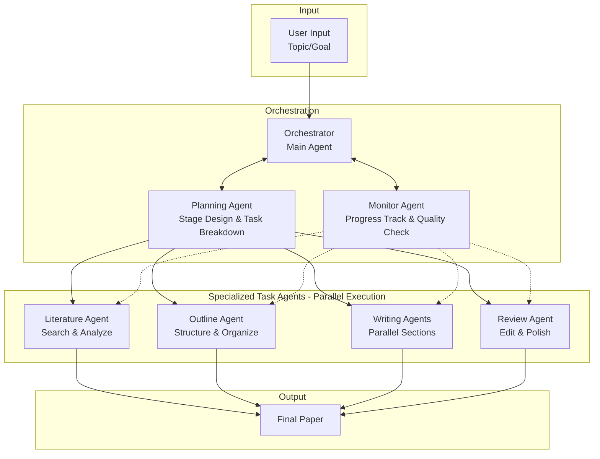
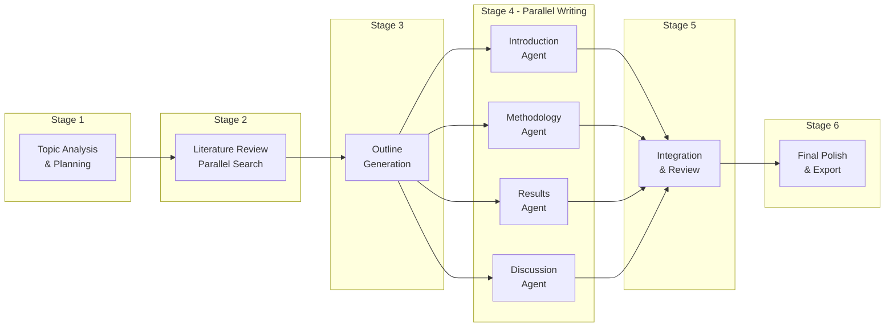
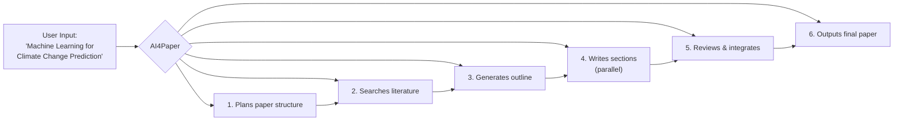

## AI4Paper - Multi-Agent Academic Paper Writing System

### Vision

AI4Paper is an intelligent multi-agent system designed to automate the academic paper writing process. Users provide a research topic, and our system orchestrates multiple specialized AI agents to collaboratively produce high-quality academic papers through a structured, stage-based workflow.

---

### Abstract Architecture

---

### Core Components

#### 1. Orchestrator (Main Agent)

The central coordinator that manages the entire paper writing workflow:

- Receives user topic/research goal
- Delegates tasks to specialized agents
- Manages inter-agent communication
- Ensures coherent final output

#### 2. Planning Agent

Responsible for strategic planning:

- Analyzes the research topic scope
- Designs the paper structure
- Breaks down work into parallel-executable stages
- Creates task dependencies and timelines

#### 3. Specialized Task Agents (Parallel Execution)

| Agent                | Responsibility                                            |
| -------------------- | --------------------------------------------------------- |
| **Literature Agent** | Search, retrieve, and analyze relevant papers and sources |
| **Outline Agent**    | Create logical paper structure and section organization   |
| **Writing Agents**   | Multiple agents writing different sections in parallel    |
| **Review Agent**     | Edit, refine, and ensure academic quality standards       |

#### 4. Monitor Agent

Quality assurance and progress tracking:

- Tracks completion status of each stage
- Validates output quality at checkpoints
- Handles error recovery and re-execution

---

### Workflow Stages

---

### Key Features

- **Topic-Driven**: Simply provide a research topic to start
- **Stage-Based Pipeline**: Clear, structured workflow with defined checkpoints
- **Parallel Execution**: Multiple agents work simultaneously on independent tasks
- **Quality Assurance**: Built-in review and refinement at each stage
- **Modular Design**: Easy to extend with new specialized agents

---

### Getting Started

---

### Contributing

We welcome contributions to expand our agent ecosystem. See our contribution guidelines for more details.

### License

See [LICENSE](../LICENSE) for details.
