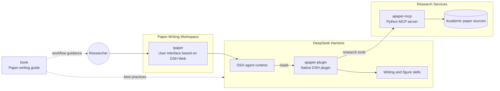

## AI4Paper — An AI Workspace for Academic Paper Writing

### Vision

AI4Paper is building an open-source workspace that helps researchers complete the entire paper-writing workflow with AI: discovering and reviewing literature, planning experiments, drafting and revising text, creating figures, managing references, and preparing a paper for submission.

[`ipaper`](https://github.com/ai4paper/ipaper) is the user-facing workspace. Built on DSH Web, it brings the AI agent, paper-authoring skills, and research tools together in one interface.

---

### Architecture

The repositories form a layered system rather than a collection of separate tools:

```mermaid
flowchart LR
    USER((Researcher)) --> IPAPER

    subgraph UI [Paper-Writing Workspace]
        IPAPER[ipaper<br/>User interface based on DSH Web]
    end

    subgraph AGENT [DeepSeek Harness]
        DSH[DSH agent runtime]
        PLUGIN[apaper-plugin<br/>Native DSH plugin]
        SKILLS[Writing and figure skills]
        DSH -->|loads| PLUGIN
        PLUGIN --> SKILLS
    end

    subgraph RESEARCH [Research Services]
        MCP[apaper-mcp<br/>Python MCP server]
        SOURCES[(Academic paper sources)]
        MCP --> SOURCES
    end

    IPAPER --> DSH
    PLUGIN -->|research tools| MCP

    BOOK[book<br/>Paper-writing guide]
    BOOK -.->|workflow guidance| USER
    BOOK -.->|best practices| AGENT
```

- **`ipaper` is the workspace:** the interface where researchers coordinate and finish paper-writing jobs from literature review through submission.
- **`apaper-plugin` is the agent capability layer:** a native DSH plugin that equips the agent with academic writing, figure creation, and paper-research capabilities.
- **`apaper-mcp` is the research service:** a Python MCP server that searches academic sources, retrieves metadata and BibTeX, and downloads papers.
- **`book` is the workflow guide:** practical guidance and best practices for the complete AI-assisted paper lifecycle.

### Repositories

| Repository | Stack | Role |
| ---------- | ----- | ---- |
| [**ipaper**](https://github.com/ai4paper/ipaper) | DSH Web · TypeScript | The user interface for the complete paper-writing workflow. It is being redeveloped on top of DSH Web to provide an integrated workspace for research, writing, figures, references, and other paper-related jobs. |
| [**apaper-plugin**](https://github.com/ai4paper/apaper-plugin) | DeepSeek Harness · Cordis | A native DSH plugin for academic paper authoring. It adds writing and publication-quality figure skills and connects the agent to `apaper-mcp` research tools. |
| [**apaper-mcp**](https://github.com/ai4paper/apaper-mcp) | Python 3.12+ · uv | A Python MCP server for academic research. It searches arXiv, IACR ePrint, DBLP, Google Scholar, and CNKI; retrieves metadata and BibTeX; and downloads supported PDFs. |
| [**book**](https://github.com/ai4paper/book) | Typst | A practical guide to the full AI/ML paper lifecycle: setup, problem selection, experiments, data and figures, writing, submission, revision, and post-acceptance work. |

#### How they work together

1. A researcher works in **`ipaper`**, the DSH Web-based paper-writing interface.
2. The DSH agent loads **`apaper-plugin`** to gain specialized writing and figure-generation skills.
3. The plugin uses **`apaper-mcp`** when the agent needs to search the literature, collect citations, or download papers.
4. The **`book`** provides workflow guidance and best practices throughout the process.

For direct use outside `ipaper`:

- Install the plugin in a DeepSeek Harness profile with `dsh plugin --profile web add @ai4paper/apaper-plugin`.
- Run the Python MCP server with `uvx apaper-mcp`, or connect any MCP-compatible client to it as a local stdio server.

---

### Contributing

We welcome contributions across all repositories. Open an issue or pull request in the project most closely related to your change.

### License

See [LICENSE](../LICENSE) for details.
