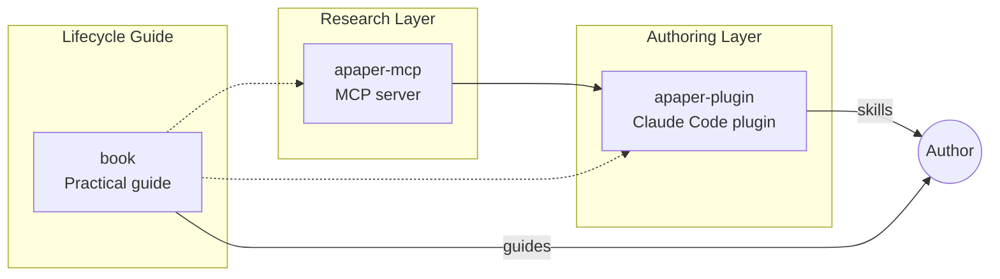

## AI4Paper — Tools for AI-Assisted Academic Paper Writing

### Vision

AI4Paper builds open-source tools and practical guidance that help researchers move from a topic to a finished paper with AI assistance — from literature search and experiments to drafting, figures, submission, and revision.

---

### Repositories

Together, these repositories provide tools and guidance for the full research-paper lifecycle.

```mermaid
flowchart LR
    subgraph Research [Research Layer]
        MCP[apaper-mcp<br/>MCP server]
    end

    subgraph Authoring [Authoring Layer]
        PLUGIN[apaper-plugin<br/>Claude Code plugin]
    end

    subgraph Guidance [Lifecycle Guide]
        BOOK[book<br/>Practical guide]
    end

    MCP --> PLUGIN
    PLUGIN -->|skills| Author((Author))
    BOOK -->|guides| Author
    BOOK -.-> MCP
    BOOK -.-> PLUGIN
```

| Repository | Stack | What it does |
| ---------- | ----- | ------------ |
| [**apaper-mcp**](https://github.com/ai4paper/apaper-mcp) | Bun · TypeScript | MCP server for paper research — searches IACR, DBLP, and Google Scholar; collects BibTeX entries; downloads IACR PDFs. Published as [`@ai4paper/apaper-mcp`](https://www.npmjs.com/package/@ai4paper/apaper-mcp). |
| [**apaper-plugin**](https://github.com/ai4paper/apaper-plugin) | Python · Claude Code | A Claude Code plugin that bundles three skills — `ieee-journal-writing`, `creating-figures` (TikZ), and `pdf` — with the `apaper-mcp` server, so one install gives Claude Code everything it needs to research, draft IEEE prose, render figures, and process PDFs. |
| [**book**](https://github.com/ai4paper/book) | Typst | A practical guide to using AI4Paper throughout the full AI/ML paper lifecycle: foundations, setup, problem selection, experiments, data and figures, writing, submission, revision, and post-acceptance work. |

#### How they compose

- **In Claude Code (terminal/IDE):** install [`apaper-plugin`](https://github.com/ai4paper/apaper-plugin) via `/plugin marketplace add ai4paper/apaper-plugin`. The plugin auto-wires [`apaper-mcp`](https://github.com/ai4paper/apaper-mcp) and registers the writing / figure / PDF skills.
- **Across the paper lifecycle:** follow the [`book`](https://github.com/ai4paper/book) for practical guidance from setting up a project and finding a research problem through experiments, writing, submission, revision, and post-acceptance work.
- **Bring-your-own client:** point any MCP-compatible client at [`apaper-mcp`](https://github.com/ai4paper/apaper-mcp) directly for just the research tools.

---

### Contributing

We welcome contributions across all repos. Open an issue or PR on the relevant repository.

### License

See [LICENSE](../LICENSE) for details.
