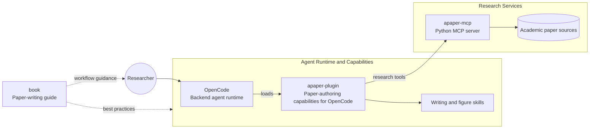

## AI4Paper — An AI Workspace for Academic Paper Writing

### Vision

AI4Paper is building an open-source workspace that helps researchers complete the entire paper-writing workflow with AI: discovering and reviewing literature, planning experiments, drafting and revising text, creating figures, managing references, and preparing a paper for submission.

AI4Paper now uses [OpenCode](https://opencode.ai) as its backend agent runtime, with [`apaper-plugin`](https://github.com/ai4paper/apaper-plugin) providing paper-authoring capabilities and [`apaper-mcp`](https://github.com/ai4paper/apaper-mcp) providing research tools. DSH is no longer the runtime, and development of the former [`ipaper`](https://github.com/ai4paper/ipaper) workspace has stopped.

---

### Architecture

The repositories form a layered system rather than a collection of separate tools:

```mermaid
flowchart LR
    USER((Researcher)) --> OPENCODE

    subgraph AGENT [Agent Runtime and Capabilities]
        OPENCODE[OpenCode<br/>Backend agent runtime]
        PLUGIN[apaper-plugin<br/>Paper-authoring capabilities for OpenCode]
        SKILLS[Writing and figure skills]
        OPENCODE -->|loads| PLUGIN
        PLUGIN --> SKILLS
    end

    subgraph RESEARCH [Research Services]
        MCP[apaper-mcp<br/>Python MCP server]
        SOURCES[(Academic paper sources)]
        MCP --> SOURCES
    end

    PLUGIN -->|research tools| MCP

    BOOK[book<br/>Paper-writing guide]
    BOOK -.->|workflow guidance| USER
    BOOK -.->|best practices| AGENT
```

- **OpenCode is the backend agent runtime:** it runs the agent that coordinates paper-writing tasks and uses specialized skills and research tools.
- **`apaper-plugin` is the agent capability layer:** it targets OpenCode and equips the agent with academic writing, figure creation, and paper-research capabilities.
- **`apaper-mcp` is the research service:** a Python MCP server that searches academic sources, retrieves metadata and BibTeX, and downloads papers.
- **`book` is the workflow guide:** practical guidance and best practices for the complete AI-assisted paper lifecycle.

### Repositories

| Repository | Stack | Role |
| ---------- | ----- | ---- |
| [**apaper-plugin**](https://github.com/ai4paper/apaper-plugin) | OpenCode | The academic paper-authoring capability layer for the OpenCode agent runtime. It adds writing and publication-quality figure skills and connects the agent to `apaper-mcp` research tools. |
| [**apaper-mcp**](https://github.com/ai4paper/apaper-mcp) | Python 3.12+ · uv | A Python MCP server for academic research. It searches arXiv, IACR ePrint, DBLP, Google Scholar, and CNKI; retrieves metadata and BibTeX; and downloads supported PDFs. |
| [**book**](https://github.com/ai4paper/book) | Typst | A practical guide to the full AI/ML paper lifecycle: setup, problem selection, experiments, data and figures, writing, submission, revision, and post-acceptance work. |
| [**ipaper**](https://github.com/ai4paper/ipaper) | Legacy workspace | The former user-facing workspace. Development has stopped; it is not part of the current architecture. |

#### How they work together

1. A researcher uses **OpenCode** as the agent runtime for paper-writing tasks.
2. OpenCode loads **`apaper-plugin`** to gain specialized writing and figure-generation skills.
3. The plugin uses **`apaper-mcp`** when the agent needs to search the literature, collect citations, or download papers.
4. The **`book`** provides workflow guidance and best practices throughout the process.

For setup and direct use:

- Follow the [`apaper-plugin` README](https://github.com/ai4paper/apaper-plugin#readme) for OpenCode setup instructions.
- Run the Python MCP server with `uvx apaper-mcp`, or connect any MCP-compatible client to it as a local stdio server.

---

### Contributing

We welcome contributions across all repositories. Open an issue or pull request in the project most closely related to your change.

### License

See [LICENSE](../LICENSE) for details.
