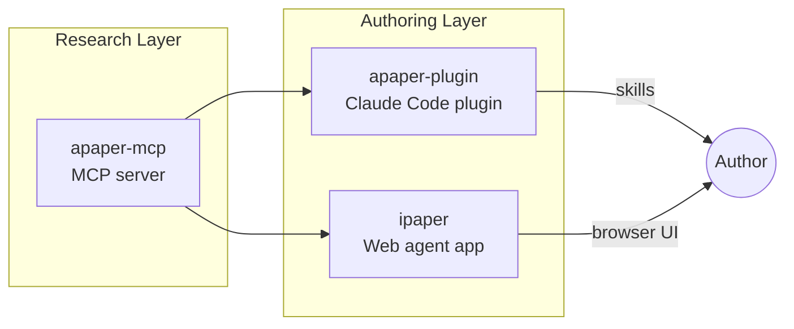

## AI4Paper — Tools for AI-Assisted Academic Paper Writing

### Vision

AI4Paper builds open-source tools that help researchers move from a topic to a finished paper with AI assistance — literature search, drafting, figures, and PDF handling — across both terminal and browser workflows.

---

### Repositories

Each repo is independently usable today, and together they cover research, drafting, and delivery.

```mermaid
flowchart LR
    subgraph Research [Research Layer]
        MCP[apaper-mcp<br/>MCP server]
    end

    subgraph Authoring [Authoring Layer]
        PLUGIN[apaper-plugin<br/>Claude Code plugin]
        IPAPER[ipaper<br/>Web agent app]
    end

    MCP --> PLUGIN
    MCP --> IPAPER
    PLUGIN -->|skills| Author((Author))
    IPAPER -->|browser UI| Author
```

| Repository | Stack | What it does |
| ---------- | ----- | ------------ |
| [**apaper-mcp**](https://github.com/ai4paper/apaper-mcp) | Bun · TypeScript | MCP server for paper research — searches IACR, DBLP, and Google Scholar; collects BibTeX entries; downloads IACR PDFs. Published as [`@ai4paper/apaper-mcp`](https://www.npmjs.com/package/@ai4paper/apaper-mcp). |
| [**apaper-plugin**](https://github.com/ai4paper/apaper-plugin) | Python · Claude Code | A Claude Code plugin that bundles three skills — `ieee-journal-writing`, `creating-figures` (TikZ), and `pdf` — with the `apaper-mcp` server, so one install gives Claude Code everything it needs to research, draft IEEE prose, render figures, and process PDFs. |
| [**ipaper**](https://github.com/ai4paper/ipaper) | Bun · React 19 · Hono | Full-stack web agent app for paper writing, powered by the [Claude Agent SDK](https://docs.anthropic.com/en/docs/agents). Long-lived per-chat sessions stream over WebSockets to a desktop/tablet/mobile PWA. Web package published as [`@ai4paper/ipaper`](https://www.npmjs.com/package/@ai4paper/ipaper). |

#### How they compose

- **In Claude Code (terminal/IDE):** install [`apaper-plugin`](https://github.com/ai4paper/apaper-plugin) via `/plugin marketplace add ai4paper/apaper-plugin`. The plugin auto-wires [`apaper-mcp`](https://github.com/ai4paper/apaper-mcp) and registers the writing / figure / PDF skills.
- **In a browser:** run [`ipaper`](https://github.com/ai4paper/ipaper) for the same agent capabilities behind a chat UI, with session-persistent context and prompt cache across turns.
- **Bring-your-own client:** point any MCP-compatible client at [`apaper-mcp`](https://github.com/ai4paper/apaper-mcp) directly for just the research tools.

---

### Contributing

We welcome contributions across all repos. Open an issue or PR on the relevant repository.

### License

See [LICENSE](../LICENSE) for details.
